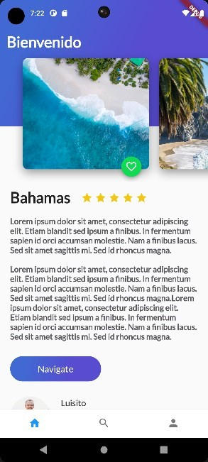
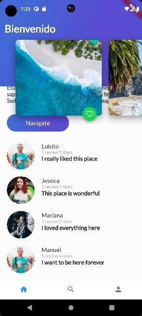

# Viajes flutter

Un proyecto creado con el fin de maquetar una aplicación que posteriormente va a ser modificada para agregar la funcionalidad y hacer que sea interactiva

Contenido de flutter probado en el proyecto:
- StatelessWidget
  - WidgetImage
  - Column
  - BoxDecoration
  - ListView
  - Gradient
  - InkWell
  - ...
- StatefulWidget
  - FloatingActionButton 
  - BottomNavigationBar
  - ...

## Salida

